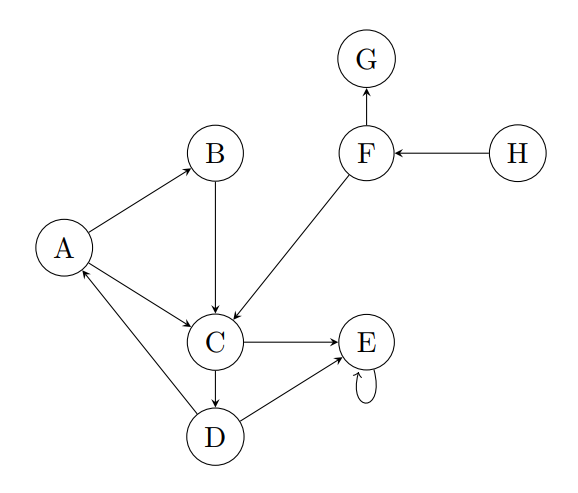

# Project Description
## Question 1
In this exercise, we want to verify basic properties of the directed graph below:

To model the structure and the properties of the graph, we use the following predicates:
- Edge(x, y) holds if there is a (directed) edge from x to y
- Reachable(x, y) holds if there is a path from x to y, i.e. y is reachable from x
- Isolated(x) holds if x is an isolated node, i.e. x has no incoming or outgoing edges

Solve the following tasks in Z3. Do not use additional predicates or sorts.

1. Fully specify the graph given above by providing the definition of the Edge relation.

2. Define the following axiom.
- ∀x [Reachable(x, x)] - Every node can reach itself.

3. Define the following axiom.
- ∀x∀y∀z [Edge(x, y) ∧ Reachable(y, z) ⇒ Reachable(x, z)] - If there is an edge from x to y and y can reach z then x can reach z.

4. Define the following axiom.
- ∀x Isolated(x) ⇒ (¬∃y [Edge(x, y) ∨ Edge(y, x)]) - A node is isolated if and
only if there is no incoming or outgoing edge

5. Show that vertex E is reachable from vertex A and that no vertex in the graph is isolated.

## Question 2
There are four stores which sell three types of items: tools (screwdrivers, saws and hammers), snacks (chips, sweets and cookies) as well as beverages (water, juice, coke).

Given that we know the facts given in the list below, use Z3 to prove that (a) Store 1 sells coke, (b) there is (at least) one snack sold by both Store 2 and 3, and (c) (at least) one store sells both juice and water. 

Formulate each of the facts (1.-10.) and the statements to be proven (a-c) as a separate statement in Z3.

1. Any item is either a tool, a snack, or a beverage.

2. Store 1 and 4 sell saws and Store 3 sells sweets.

3. Every item is sold by at least one store.

4. Exactly one store has all 3 types of snacks.

5. There is no store that sells both water and saws.

6. Any store that sells juice also sells another beverage.

7. Store 1 sells (at least) one tool, one snack and one beverage.

8. Store 2 has no beverages to offer.

9. Every store sells exactly 3 different items.

10. Exactly 3 items are sold by 2 or more (possibly different) stores and they are one tool and two snacks. All others items are sold by a single store.