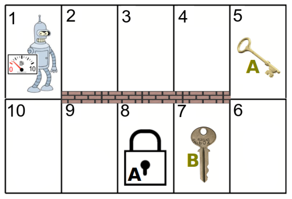

# Project Description
In this exercise, your task is to model the following planning problem in PDDL. We have one or more robots that can move on a map. There can be at most one robot at each location. There are keys placed on some locations. A robot can pick up a key if the robot is standing at the same location as the key. A robot can hold any number of keys at the same time, but it can also drop a key at any location. There can be any number of keys at any location. Some locations can be locked in which case no robot can move to these locations. The locked locations can be unlocked by a specific key if the robot holding the key is standing next to the locked location. Once the location is unlocked, robots can step on this location. Robots are also limited by the number of fuel they have. Moving from one location to another consumes exactly one unit of fuel. Once all the fuel is depleted, the robot cannot move anymore. There is no way of re-fuelling the robot. The goal is to move certain keys to certain locations.

An illustration of such a problem is depicted on figure: 
In this case, there is only a single robot which can move between adjencent locations. The location 8 is locked and can be unlocked only by the key A. The robot has initially 10 units of fuel, and the goal is to move the key B to location 1. This is just one possible problem from the domain you are tasked to model.

You are provided with a template PDDL domain file `domain.pddl` and three PDDL problem files `problem1.pddl`, `problem2.pddl`, and `problem3.pddl`. Your task is to finish definitions of the actions:

- `move-robot` - This action moves the robot between two connected locations while depleting one unit of fuel. The parameter `?r` is a robot, `?f` is robot’s current location, `?t` is robot’s destination location, `?f1` is robot’s current fuel level, and `?f2` is robot’s fuel level after the move.

- `take-key` - This action makes the robot take the specified key from the robot’s current location. The paramter `?r` is a robot, `?k` is the key that is taken by the robot, and `?l` is the current location.

- `drop-key` - This action makes the robot drop the key it’s holding on the current location. The paramter `?r` is a robot, `?k` is the key that robot holds, and `?l` is the
current location.

- `unlock` - This action makes the robot to unlock the currently locked location adjecent to the current robot’s location (i.e., the current robot’s location must be connected to the locked location). The paramter `?r` is a robot, `?k` is the key that robot holds, `?f` is robot’s current location, and `?t` is the locked location.

You are allowed to use only the predicates already defined in the domain file:

- The predicates `robot`, `location`, `key`, `fuel` are used just for typing of objects. They are set in the initial state and cannot appear in any effect. Moreover, we already used these predicates in action definitions to make it clear what each parameter of each action means. So, you don’t need to use there predicates.

- The predicate `connect` encodes that two locations are connected and therefore a robot can move between these two locations. This predicate cannot appear in any effect, because this is a "static" information that holds in all reachable states.

- To encode the counter of fuel units, we use objects `fuel1`, `fuel2`, ... to encode the number of fuel units, and the predicate `fuel-predecessor` to encode which number of fuel units immediately precedes other number of fuel units. For example, (`fuel-predecessor` `fuel1` `fuel2`) means that if a robot has `fuel2` number of fuel units and moves, the number of fuel units will decrease to `fuel1`. This predicate cannot be used in any effect either.

- The predicate (`at ?x ?y`) encodes that the robot or key `?x` is currently at location
`?y`.

- The predicate (`holding ?r ?k`) encodes that the robot `?r` holds the key `?k`. (Recall that a robot can hold any number of keys.)

- The predicate (`free ?l`) encodes that the location `?l` is free and a robot can be move to this location. (Recall that two robots cannot occupy the same location.)

- The predicate (`locked ?l ?k`) encodes that the location `?l` is locked by the key `?k`, and can be unlocked by the same key `?k`. (The location that is locked is not free, i.e., a robot cannot move to such location.)

- The predicate (`fuel-level ?r ?f`) encodes that the robot `?r` has currently `?f` number of fuel units.