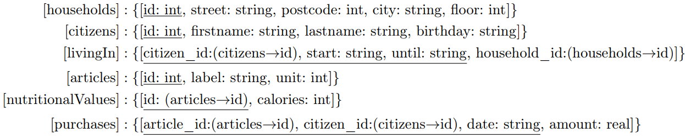

# Project Description
Given the following relational schema, which is based on the data set from the notebook `NSA.ipynb`.

## Assignment 1
Your task is to translate the following natural language queries into appropriate SQL queries. You can test your queries by pasting them into the space provided in the attached notebook. Note that dates (_start_ and _until_ in `livingIn`, _birthday_ in `citizens`, and _date_ in `purchases`) in this schema always follow the format `YYYY-MM-DD HH:MI:SS`. 

1. Identify the households that have a 13 as their house number and in which at least two citizens born before 1920 have lived or still live there. Your output should consist of the following values ​​and be sorted in ascending order by street name: 

- The street of the household as "Straße", 

- The postal code of the household as "PLZ", 

- The city of the household as "Stadt". 

Note: The house number is always at the end of the _street_ attribute in `households`. 

2. For each individual item, identify which citizens bought the most of it in one purchase. The output should consist of the following values ​​and be sorted in descending order by the name of the food and also only contain the first 10 tuples:

- The name of the food as "Bezeichnung",

- The maximum amount (in liters or kilograms) of this item that was bought in one purchase as "Menge",

- The first name of the citizen as "Vorname",

- The last name of the citizen as "Nachname"

3. Identify the citizens who moved into exactly two households between 1900 and 1949 (both inclusive). In addition, calculate the calories purchased by these citizens in the period between 1900 and 1949 (both inclusive). The output should be sorted in descending order by calories purchased:

- The citizen's first name as "Vorname",

- The citizen's last name as "Nachname",

- The total calories purchased by this citizen during this period as "Kalorien".

Note: The calories in nutritionalValues ​​are given in kcal/100g, while the amount of the purchased item in purchases (amount) is given in kg. So you need to convert kcal/100g to kcal/kg.

## Assignment 2

Inspector Equi-Join recently spoke with his superior and mentor, Chief Inspector Theta-Join, about old cases, which drew Equi-Join's attention to one of his few unsolved cases. This involves the murder of John Doe, which occurred on November 24, 1943. According to the autopsy report, the cause of death was determined to be a very rare (and fictitious!) poison, which, however, according to the responsible forensic pathologist, Dr. Selection, can be made using a list of everyday foods. This list consists of:

- Exactly 500 grams of pickles.

- At least two kilograms of lettuce.

- At least one kilogram of carrots, but a maximum of three kilograms (inclusive).

Dr. Selection also said that these foods can be used as poison for a maximum of five days (inclusive) after purchase, otherwise the effect would be too weak.

Based on this assumption, Inspector Equi-Join initiated a review of the documented purchases in the local supermarkets. Unfortunately, he could not do much with this data. Therefore, he subsequently questioned witnesses about suspicious activities on the day of the murder, but this was also unsuccessful. 

Inspector Equi-Join is now convinced that he can solve the case with your help. To do this, he retrieves the old interviews with the witnesses. Unfortunately, the statements have become largely unreadable due to the age of the documents. He can only find one page of information in which witnesses report how suspicious people returned to their homes on the day of the murder. The following information about the addresses of the suspects is still legible:

- Address 1: ...18

- Address 2: ...street 1...

- Address 3: L...

In this context, Inspector Equi-Join gives you the population register from that time, in which information about the local residents and their registered houses can be found, as well as the data about the purchases registered at that time. Can you use this data to help Inspector Equi-Join solve his old case? Submit your solution as an SQL query that has the following output:

- The first names of the suspects as "Vorname".

- The last names of the suspects as 'Nachname".