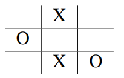
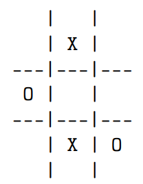
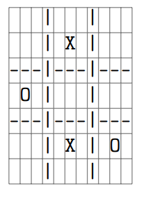
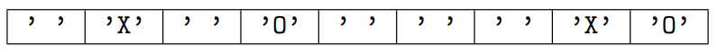

# Project Description: Tic Tac Toe (MIPS)

In this project, you will implement the popular game Tic-Tac-Toe in MIPS Assembler. You can find an astonishingly detailed explanation of the rules of the game on Wikipedia (https://en.wikipedia.org/wiki/Tic-Tac-Toe).

To make it easier to work on, the project is divided into several tasks. Each task has its own file in which you will write the respective subprogram. The file `src/main.s` calls the subprograms you are to write.

## Dealing with the playing field
Write a subprogram `drawBoard` ([src/view.s](src/view.s)) that displays the playing field. Your subprogram receives the following arguments: The address of the playing field.

The player characters are the ASCII capital letters `’X’` (ASCII code 88) and `’O’` (ASCII code 79). The vertical lines are represented by the character `’|’` (ASCII code 124), horizontal lines by the minus sign `’-’` (ASCII code 45). Empty playing fields are represented by the normal space character `’ ’` (ASCII code 32).

## Perform a move
Write a subprogram `takeTurn` ([src/turn.s](src/turn.s)) that places a player character at a specified position, if possible. You will receive the position encoded in ASCII characters. Note that rows/columns are numbered starting with 0 (line ’1’ is logically the second line, etc.). Your subprogram receives the following arguments:
1. The address of the playing field.

2. The ASCII character of the player whose turn it is.

3. The target row as an ASCII character.

4. The target column as an ASCII character.

(a) Logical state of the playing field.
 

(b) Console output of the procedure drawBoard.

(c) Character position of the console output.

(d) Byte-by-byte memory extract of the playing field from its start address (address of the playing field). Each byte encodes a box of the playing field as an ASCII code (`’O’`, `’X’` or `’ ’`). The boxes of the playing field are arranged line by line, starting with the top line, from left to right in the memory.

If the specified move is not possible, the subprogram returns the number 1 and leaves the playing field unchanged. If the move is possible, the subprogram writes the player's character to the corresponding row and column in the playing field. If successful, the number 0 is returned. A move is possible if the following conditions apply: 
- The ASCII characters passed in arguments three and four describe a valid target row and column on the playing field. For example, the specification row '2' and column '0' corresponds to the bottom left box on the output playing field. The specification row 'W' and column '9' is invalid. 

- The playing field is free at the specified row and column (contains the ASCII space `’ ’` at the corresponding address).

### Check victory condition 
Write a subprogram `testWin` ([src/check.s](src/check.s)) that checks whether a certain player has won. Your subprogram receives the following arguments:

1. The address of the playing field.

2. The ASCII character of the player whose victory is to be checked.

The subprogram determines whether the player with the passed character has won on the current playing field. If this player has won, the subprogram returns the value 1. Otherwise, the subprogram returns 0.

### Run and debug tests yourself
Use the `./run_tests` command in the project's main directory to have your implementation tested. If a test, e.g. `tests/pub/test_X.s`, fails, you can debug it in MARS.

The `./build_testbox tests/pub/test_X.s` command copies the test together with its implementation into the new `testbox/` folder, where you can start it with MARS. If you change anything in the files in the actual submission folder, you must enter the `./build_testbox tests/pub/test_X.s` command again so that the changes are adopted in the test box. Please note, however, that only the files in the paths specified in the task are included in the assessment and the automatic tests. In particular, do not enter any files in `testbox/` into the version control system.