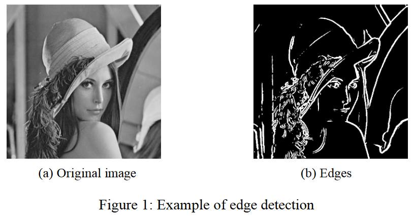
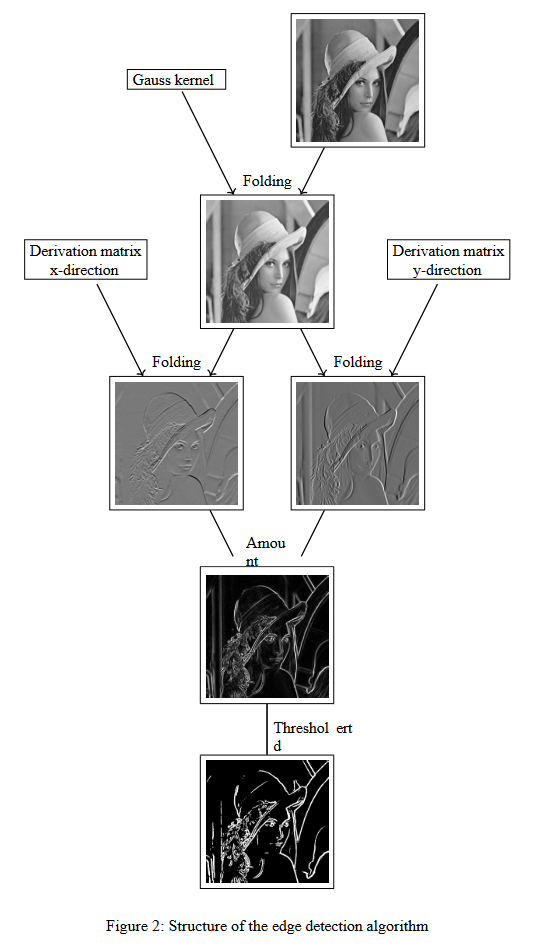
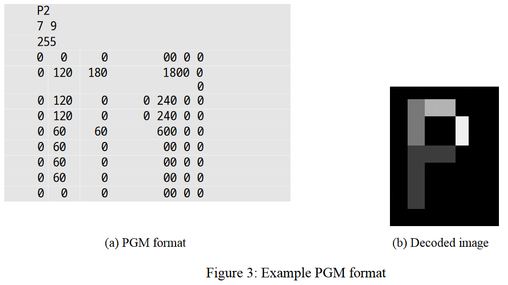
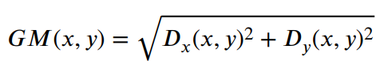
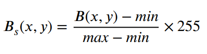
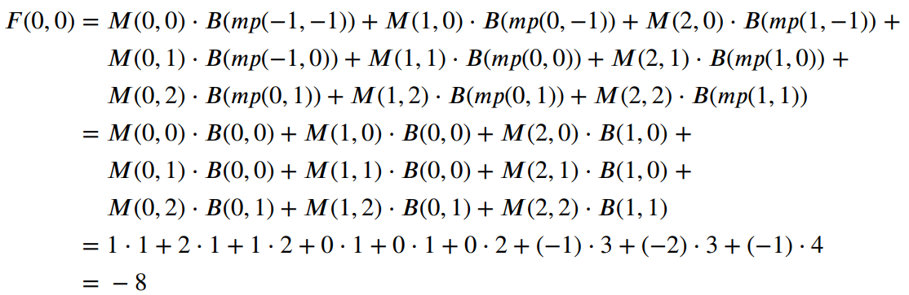
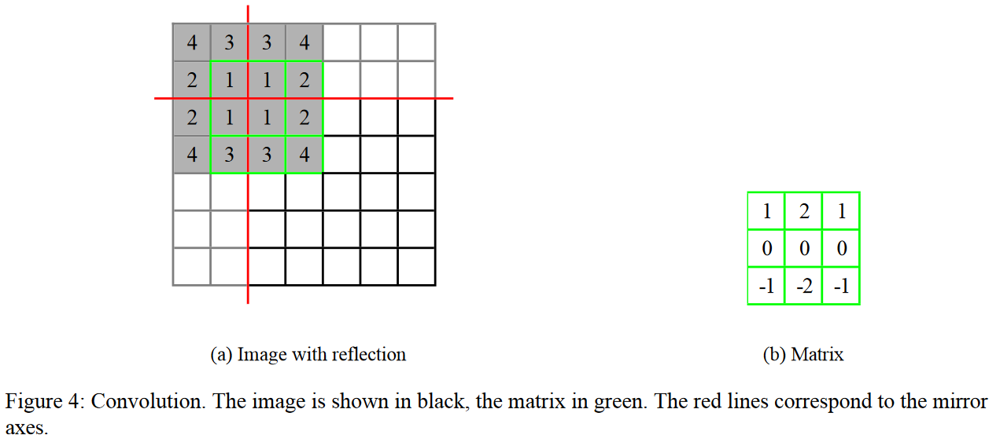

# Project Description: Edge detection (C)
In this project you will implement a program for edge detection. The aim is to find the boundaries between homogeneous areas with similar color/grey value. Edges play an important role in object recognition (human and machine) and are used, for example, in image compression

## Edge detection
The basis of the edge detection algorithm is the calculation of the discrete derivative of the image. The magnitude of the derivative represents the size of the change in the gray values of adjacent pixels and thus indicates an edge. Which pixels are counted as an edge is determined by a threshold value. The image is blurred in advance so that only the important edges are taken into account. Both the calculation of the derivative and the blurring of the image are based on the mathematical operation convolution. This is specified in more detail below.

### Algorithm
The algorithm consists of the following steps:
1. Importing the original image

2. Blurring of the image by a convolution with a Gaussian kernel

3. Derivation of the image in x and y direction by convolution of the blurred image with predefined matrices for discrete derivation

4. Calculation of the amount of the gradient (vector from derivative in x and y direction)

5. Determination of edges as pixels whose gradient value exceeds the given threshold value

6. Output of the edges as a black and white image

The results of the individual steps are shown in Figure 2.


## General information on processing the project
### Compiling the project
The project can be easily compiled on the command line using the `make` command. The generated `edgedetection` application can be found in the `bin` directory.

### Command line arguments
The application implements the following command line syntax:
```
edgedetection -T <threshold> <image file>
```
The command line arguments are described in detail below:
- `-T <threshold>` - Threshold value for step 5 of the algorithm.

- `<image file>` - Path to the input image

For example, if you want to run the program from the root directory of the project with a quick value of 100 and the test image `img_P.pgm`, this corresponds to the command
```
./bin/edgedetection -T 100 test/data/input/img_P.pgm
```
Reading in the command line arguments is already implemented and does not require any further attention from you. The values read in are saved in the global variables `image_file_name` and threshold (see `argparser.h`).

### Picture format
We use the portable graymap format as input and output format. It has the extension `pgm`. pgm files are structured as follows:

**Header data**
1. P2
2. \<empty space>
3. \<Width of the image>
4. \<empty space>
5. \<Height of the image>
6. \<empty space>
7. \<Maximum value for brightness> (here always 255)

**Image data** 
The header area is followed by the integer gray values of the pixels. These are all between 0 and 255 The individual values are separated from each other by a space of any length (at least one space, tab, carriage return or line feed). Figure 3 shows an example. To illustrate this, a line break has been inserted after every 7 values. This does not have to be the case.


### Representation of an image in the C program
Images are displayed as a sequence of `floats`. The elements of the array represent the gray values of the pixels . To display a two-dimensional image of width *r* and height *h*, a one-dimensional array of size *r ∙ h* is required. The pixels are stored line by line in the sequence: The pixel with coordinate *x, y* is located at position *x + **r** ∙ y* in the array, where ***r*** is the width of the image in pixels.

## Tasks
The tasks are arranged primarily according to their difficulty and the lecture material and not according to the order in the algorithm. We recommend that you stick to the given order. All functions to be implemented are
documented in the corresponding `.h` files.

### Threshold value
Set each pixel whose gray value is greater than the threshold value T to pure white (255) and whose gray value is less than or equal to T to pure black (0).

To do this, implement the following function in the `image.c` file:
```
void apply_threshold(float *img, int w, int h, int T)
```
### Amount 
After the discrete derivative in the x and y directions, the magnitude of the gradient is required. Let D<sub>x</sub> and D<sub>y</sub> be the discrete derivatives in the x and y directions respectively. The magnitude of the gradient *GM* at the point (x,y) is defined as:



To do this, implement the following function in the `derivation.c` file:
```
void gradient_magnitude(float *result, const float *d_x, const float *d_y, int w, int h)
```
The `result` parameter represents the output image in which the calculated amounts must be entered. The parameters `d_x` and `d_y` are series that specify the derivatives D<sub>x</sub> and D<sub>y</sub> of the image in the x and y directions respectively.  As with images, the derivatives are saved line by line at the pixels: The derivative for pixel *x, y* is located at the position *x + **r** ∙ y* of the sequence. The parameters `w` and `h` specify the width and height of the image. The standard library function
`sqrt` should be useful here.

### Scaling of the gray values
The calculation of the derivative and the magnitude of the gradient lead to results outside the range 0 to 255. Therefore, the values must be scaled back into this range before they can be output as a pgm image. The scaling is defined as follows:

Let *max* or *min* be the maximum or minimum value within the image *B*. Then the scaled value B<sub>s</sub> at position (x,y) is defined as:

In the special case *max = min*, a black image should be output. To do this, implement the following function in the `image.c` file:
```
void scale_image(float *result, const float *img, int w, int h)
```
The `result` parameter represents the output image in which the calculated scaled gray values must be entered. The `img` parameter represents the input image to be scaled. The parameters `w` and `h` specify the width and height of the image.

### Folding 
The two-dimensional convolution between the image *B* with the width *r<sub>B</sub>* and height h<sub>B</sub> and the matrix *M* with the width *r<sub>B</sub>* and height *h<sub>B</sub>* for the pixel at the position *(x, y)* is defined as:

Here, *a* is the x-coordinate and *b* is the y-coordinate of the center point of the matrix. You can assume that both *r<sub>M</sub>* and *h<sub>M</sub>* are odd, so that the center point is clearly defined.

If the coordinates *B(x + i - a, y + j - b)* do not lie within the image, the gray value of the pixel that lies at the given position is used when the image is mirrored at its outer edges.

**Example** In the following example, based on Figure 4, the result of the convolution is calculated for the pixel at position (0, 0). The image *B* is shown in black and the matrix *M* in green. The red lines correspond to the mirror axes. The function *mp(i, j)* calculates the mirrored coordinate.


First think about how to mirror a coordinate if it is outside the image. Then first implement the function
```
float get_pixel_value(const float *img, int w, int h, int x, int y)
```
in the `image.c` file. This function outputs the value of the pixel at coordinate `(x, y)` if this is within the image, otherwise the value of the pixel at the mirrored position. Use this to call the function
```
void convolve(float *result, const float *img, int w, int h, ...)
```
in the `convolution.c` file.

### Reading in and outputting an image
Implement a function for reading in and reading out `pgm` image files. However, write your read-in routine in such a way that it intercepts the following potential errors in the input file and returns a `NULL` pointer in this case:

- The file does not exist

- Broken header data, especially height/width data less than or equal to zero

- Too few or too many pixels

- Gray values outside the range 0-255

As the size of the image is not known until the program is running, memory must be allocated dynamically to represent the image. In addition, this memory must be released again when it is no longer used. To do this, first implement the following functions in the `image.c` file:

1. `float* array_init(int size)`
2. `void array_destroy(float *m)`

The `array_init` function dynamically associates an array of floats to represent the image as an array of grayscales. In addition, the `array_destroy` function releases a dynamically associated sequence of floats. Then implement the following functions in the `image.c` file:

1. `float* read_image_from_file(const char *filename, int *w, int *h)`
2. `void write_image_to_file(const float *img, int w, int h, const char *filename)`

The `read_image_from_file` function expects the path to the input file in the `filename` parameter. The `w` and `h` parameters are used to output the width and height of the image read in. The return value is the dynamically allocated sequence of floats representing the image read in. Remember to free allocated memory in the event of an error and to close open files before returning from the function!

The function `write_image_to_file` expects an image in the `img` parameter. The `w` and `h` parameters specify the width and height of the image. The `filename` parameter specifies the name of the output file. The gray values of the output image must be integers according to the format. Therefore, round the pixel values to the nearest integer before writing them to the file. Remember to close open files before returning from the function!

Note: You do not need to implement error handling for the output.

### Main 
The last task is to add the implemented functions to the algorithm. To do this, fill in the specified areas in the main function
```
int main(int const argc, char **const argv)
```
in the `main.c` file. The comments describe exactly what you need to implement. Remember to release
dynamically allocated memory.

Attention: Intermediate results must be scaled to the range 0 to 255 before they can be output as an image. This is only necessary for output as an image. The algorithm itself continues to calculate with the unscaled intermediate results.

## Tests
Not only the entire program but also the individual functions are tested. You should check after each task whether your implementation passes the corresponding public tests.

You can carry out the *public* tests yourself in the base directory using the `make tests` command.

### Individual tests
You can also run individual tests, which is particularly useful if larger parts of your implementation are still
missing.
- With `test/run-tests.py -l` you can display the names of all tests.

- With `test/run-tests.py -f <name>` you only run the test `<name>`. Make sure to recompile the project before running the tests!

## Editing in Visual Studio Code
We recommend that you edit the project using Visual Studio Code. Of course, you can also use the editor of your choice. It is important that the project can be compiled and tested with the commands listed above. The integrated terminal of Visual Studio Code can be used for commands. In addition, we provide you with some configuration files to enable you to work efficiently in the editor. You can compile the project directly with the key combination `Ctrl + Shift + B`. For the common commands for testing and compiling, there are tasks that you can execute via *Terminal → Run Tasks...* can be executed. 

To debug the project in the virtual machine in the Visual Studio Code Editor, you must first install the necessary extensions. To do this, simply call up the installation script provided by us with `./scripts/install_cpptools.sh` and restart Visual Studio Code. You can then debug the main function of the project. To do this, switch to the debug panel (`Ctrl + Shift + D`) and execute Select the preset start configuration "Debug Main". The program is stopped at the start of the main function.