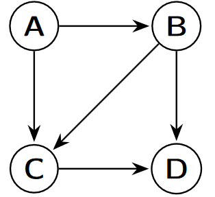
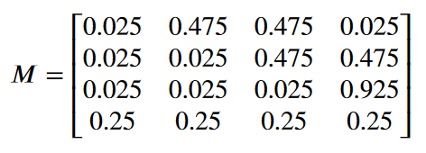
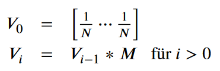
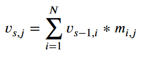

# Project Description: PageRank (C)
In this project you will calculate a node weighting in directed graphs using the PageRank algorithm.


## The PageRank algorithm
The idea of the PageRank algorithm can be found in many places on the Internet, for example on [Wikipedia](https://en.wikipedia.org/wiki/PageRank). In this project, you will only work with the normalized PageRank, i.e. the sum of all node weights always equals 1.

### Intuitive explanation: Random surfers
The PageRank algorithm was originally developed for use on linked websites. The entire Internet represents the underlying graph, with the nodes representing individual web pages and the edges resulting from the links
between pages.

Intuitively, the PageRank of a page can be understood as the probability that a surfer who happens to be surfing the Internet will end up on exactly this page after a large number of steps. This corresponds to the relative number of occurrences of this page in the infinite sequence of pages visited by a random surfer.

Here it is assumed that the random surfer follows a link on the page in each step with probability 1 - *P*, and with probability *P* calls up any randomly selected page. If a page contains no links, the random surfer always
accesses a randomly selected page.

This model can be used to approximate the PageRank of all pages by means of a random experiment . To do this, you simulate *N* steps of the random surfer and count how often each page was visited. The approximated PageRank is then calculated as this number divided by *N*.

In the example opposite, the random surfer could visit this sequence of 50 pages, for example: `ABDDBDABDBCDCACDBDACDACDABDDCDBDBCDBDCDDDBCDDBAC`. If we count the occurrences of each page, we see that page A was visited seven times, page B twelve times, page C 10 times and page D 21 times. This results in the following approximated PageRanks:

PageRank<sub>random,50</sub>(A) = 7/50 = 0.14

PageRank<sub>random,50</sub>(B) = 12/50 = 0.24

PageRank<sub>random,50</sub>(C) = 10/50 = 0.20

PageRank<sub>random,50</sub>(D) = 21/50 = 0.42

### Mathematical calculation 
The random surfer model can also be represented as a first-order Markov chain. For this purpose, transition probabilities are defined in pairs between all states. For example, the transition probability is probability from node B to node D at *P* = 0.1 is the sum of 0.1/4 (Probability of reaching node D by random selection) and 0.9/2 (Probability of selecting the outgoing edge of B)

In this way, all transition probabilities can be calculated:


Here *N* denotes the number of nodes in the graph, *out(X, Y)* the number of edges from *X* to *Y* (of which there can be any number) and *out(X)* the total number of outgoing edges from *X*. *P<sub>X,Y</sub>* is the probability of getting from node *X* to *Y*.

For the example in Figure and *P* = 0.1, this would result in the following transition matrix:


This encodes in row *i*, column *j* the transition probability from node *i* to node *j* (in this case sorted alphabetically). It can now also be used to approximate the PageRank of a page. To do this, the matrix is repeatedly multiplied by a probability vector that encodes the current probability of being in each node. This vector is initialized with 1/*N* for each node. In each step, the new vector now results from the multiplication *V ∗ M*:


This means that the probability of being at a particular node *X* in step *s* is the sum of the probabilities of being at
a node *Y* beforehand multiplied by the probability of moving from *Y* to *X*. For node *j* in step *s*, this results in the following:


Where *m<sub>i,j</sub>* is the entry in row *i* and column *j* of the transition matrix *M* and v<sub>s,i</sub> is the *i*-th entry of the probability vector V<sub>s</sub> in step *s*.

The following probability vectors result for the example in Figure:


These probability vectors converge towards the actual PageRank, even independently of the selected initial vector (as long as the sum of the entries is 1). This limit value is called the stationary distribution of the Markov chain.

## Tasks
Their task in this project is to implement both the random surfer and the calculation using the Markov chain. This chapter describes in detail which criteria your implementation has to fulfill.

### Input format
The graphs that your program processes have a predefined form. Each file begins with the keyword "digraph", followed by an identifier for the graph and an opening curly bracket. An edge is then defined for each line in the graph, followed by a final line containing only a closing curly bracket. For each edge, the identifier of the outgoing node is specified first, followed by the character string " `->` ", the identifier of the node reached, and a closing semicolon. The character string between the identifiers consists of exactly one space, an arrow consisting of a minus sign and a greater-than sign, and a further space. Line breaks are encoded with a newline character ("`\n`"). Each identifier begins with a letter, possibly followed by further letters or digits. Identifiers up to a length of 256 characters must be supported. The example graph in Figure would be coded as follows.
```
digraph TestGraph {
A -> B ;
A -> C ;
B -> C ;
B -> D;
C -> D;
}
```

It is sufficient if your program can only process exactly this representation. However, you may be less restrictive when setting spaces and line breaks, for example, i.e. accept more than specified here. Graphs in this format can also be conveniently visualized with the programs of the [Graphviz package](https://de.wikipedia.org/wiki/Graphviz). If you want to use the Graphviz programs in the VM, you can install the package with the following commands:
```
sudo pacman -Syu
sudo pacman -Sy graphviz
```

### Output format
The calculated PageRank is output on the standard output in one line per node, whereby first the identifier of the node is output, then at least one space or tab character, and then the PageRank with a precision of at least 10 decimal places.

The order in which the nodes are output is irrelevant. 

The PageRank for the graph in Figure could therefore look like this:
```
A   0.1234987158
B   0.1790731292
C   0.2596560461
D   0.4377721089
```
**Statistical output** Under certain circumstances, no PageRank should be calculated, but only statistics about the graph should be output. The following information is displayed:
- Identifier of the graph

- Number of nodes in the graph

- Number of edges in the graph

- Minimum and maximum input level (= number of incoming edges)

- Minimum and maximum output level (= number of outgoing edges)

You can see the exact output format from this example output of the graph in Figure:
```
TestGraph:
– num nodes: 4
– num edges: 5
– indegree: 0-2
– outdegree: 0-2
```

### Command line parameters
Your program must be able to receive and process the following command line parameters:

**-h** A short help on the available command line parameters is displayed.

**-m N** The calculation is performed on the basis of the Markov chain with **N** steps and the result is output. **N** is an
integer greater than 0.

**-p N** The parameter *P* for calculating the PageRank is set to **N**%. **N** is an integer between 1 and 100. If this parameter is not specified, *P* = 10%.

**-r N** A simulation of the random surfer with **N** steps is carried out and the result is output. **N** is an integer greater than 0.

**-s** A statistic of the graph is output as specified. 

At least one of the parameters **-h**, **-m**, **-r** or **-s** must be specified.

If the **-h** parameter has not been specified, exactly one further argument is expected after the options described. This specifies the file name of the input graph. It can be specified relative to the current working directory or as an absolute path, but never begins with a minus.

### Details of the PageRank implementation
To ensure a uniform behavior of all project implementations, we specify some details of the PageRank implementation here.

1. As already mentioned, the PageRank output should always be normalized so that the sum is 1.

2. A simulation of the random surfer with N steps means that a random node is initially selected and then *N* steps are executed, whereby the nodes reached are recorded and counted. The initial node is not counted.

3. Performing a calculation on the Markov chain with *N* steps means initializing a probability vector with equally distributed probabilities and then multiplying it *N* times with the matrix.
It is irrelevant here whether you actually represent the matrix in memory and perform a matrix multiplication or carry out the calculation directly on the basis of the graph. The end result must of course be the same.

### Program completion
In the regular case, the program should always be ended with exit code 0. In the event of an error, the program is always terminated with 1.

All error handling is optional in this project. You can rest assured that your program will only be called with valid command line parameters and that the input file has the correct format.

If you implement error detection, you can collect up to 2 bonus points. The following errors can occur, for example:
- Invalid command line parameters are transferred.

- The input file does not exist.

- The input file has an invalid format.

## Tests
In your depot you will find some public tests that you can run by calling `make tests` or alternatively `./tests/run-tests.py` pagerank can be executed. If you want a more detailed output, you can add the parameters `-v` or `-d` to the call, e.g. `./tests/run-tests.py pagerank -v`

Before you can run the tests, you must also install the scipy package for Python using the following two commands:
```
sudo pacman -Syu
sudo pacman -Sy python-scipy glibc valgrind
```