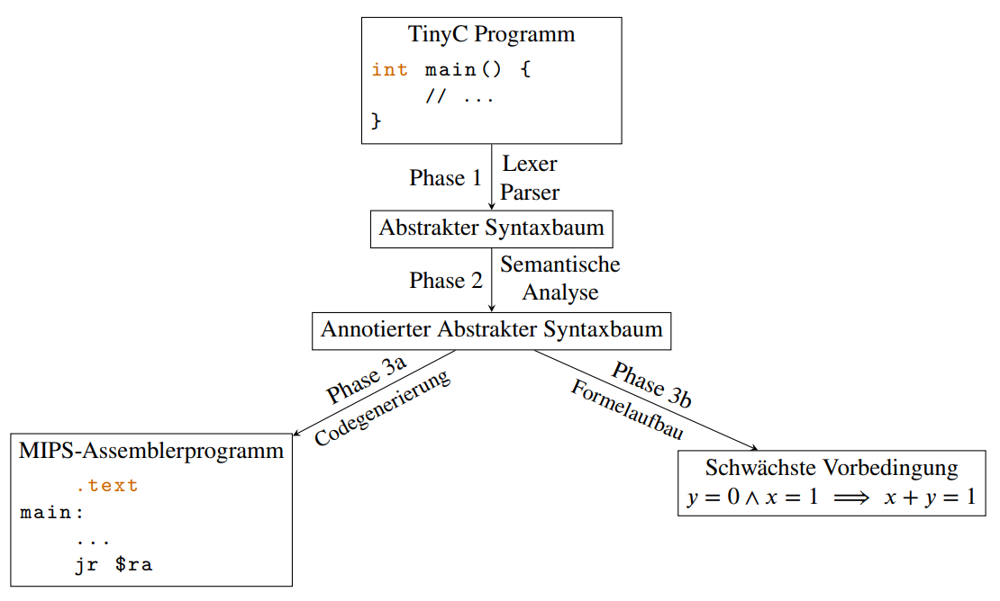

# Project Description: TinyC-Compiler (Java)

Your task in this project is to complete a compiler. The compiler translates the TINYC language into MIPS assembler and generates preconditions for the correctness of the program.

The project is divided into three consecutive subtasks (+ bonus tasks):

**Phase 1:** Construction of an abstract syntax tree

**Phase 2:** Semantic review of the program (name and type analysis)

**Phase 3a:** the generation of machine code for MIPS **or alternatively**

**Phase 3b:** setting up formulas for (weakest) preconditions

You can decide for yourself whether you prefer to implement code generation or the generation of weakest preconditions for TinyC programs. The following diagram illustrates the compiler pipeline:

For detailed information about the project, refer to the full project description [(original version](/Programming2_SS21/Project6/Projekt_6_-_Compiler.pdf), [English translation)](/Programming2_SS21/Project6/Projekt_6_-_Compiler%20en.pdf).