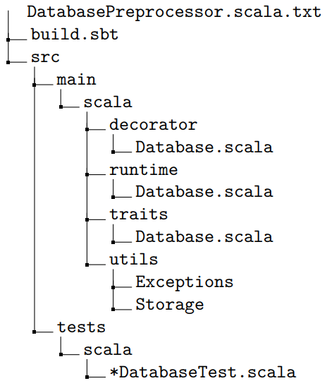
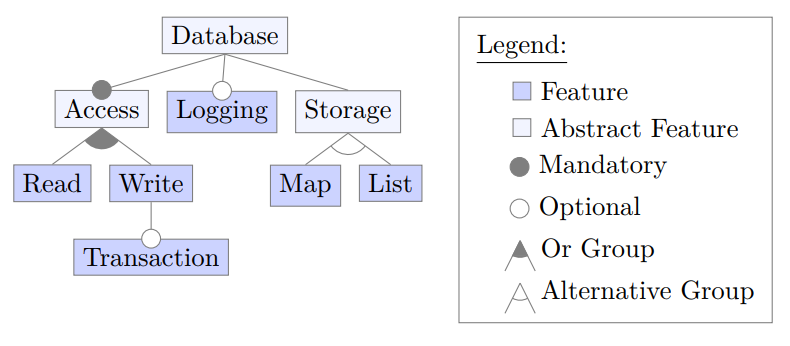
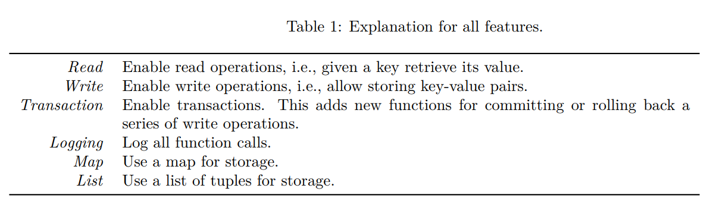

# Project Description
Your task is to implement a simple configurable database in [Scala](https://www.scala-lang.org/) using different implementation techniques. The database is a simple key-value store that allows storing a value given some key. We provide an implementation using C preprocessor directives which acts as a template for the other implementations. The logic for all features is already present in this implementation so you can focus on the different implementation techniques rather than on the logic. We highly recommend to solve the three tasks in order since this gives you a more gentle introduction to Scala before
using more advanced concepts. If you are unfamiliar with the language we recommend taking the [tour of Scala](https://docs.scala-lang.org/tour/tour-of-scala.html).

(a) Implement the configurable database using **runtime parameters** in the file `runtime/Database.scala`. We provide the database's interface and a configuration class that gets passed to the constructor of the database class. Your implementation must change its behavior based on the values in the configuration object.

(b) Implement the configurable database using the **decorator pattern** in the file `decorator/Database.scala`. We provide the component interface as well as tests that specify how the concrete component and decorator classes must be named and how they can be combined.

(c) Implement the configurable database using **[traits](https://docs.scala-lang.org/tour/traits.html) and class composition with [mixins](https://docs.scala-lang.org/tour/mixin-class-composition.html)** in the file `traits/Database.scala`. We provide the database’s interface as well as tests that specify how the traits must be named and how they can be combined.

**Note:** The logging feature is cross-cutting to the other features and, hence cannot be implemented as a single trait with the given Database interface. Instead, you should create one separate logging-trait for each of the other traits you create (e.g. `trait LoggingWithRead extends Read`).

## Project Skeleton 
You must implement your solution based on the provided project skeleton. The skeleton has the following structure:

The file `DatabasePreprocessor.scala.txt` contains a implementation of the configurable database using C preprocessor directives. We also provide some interfaces and tests for each task which can be found in the respective subfolders of `src`. The utils package contains the different storage implementations (*Map* and *List*) that have to be used by the database, as well as the `ConfigurationError` exception that should be thrown by the runtime and decorator implementations when a function is called that is not part of the current configuration (e.g., if `write()` is called but the feature *Write* is disabled.). This is necessary because with these implementation techniques it is not possible to change the interface depending on the selected features. The file `build.sbt` contains a build script that we use to [build your submission and run the tests](https://www.scala-sbt.org/1.x/docs/).

The build script should also enable you to import the project skeleton into any IDE with Scala support (e.g., IntelliJ with the Scala plugin). Scala can be quite sensitive regarding the used language version and things might break if you use the wrong one. For the assignment, we use Scala 3.2.1 which is also specified in the build script. You can also run the tests included with the project skeleton using the build script. To run all tests execute the command `sbt test`.

## Feature Model 
The configurable database we implement follows the following feature model:

The following table explains each feature in more detail:
