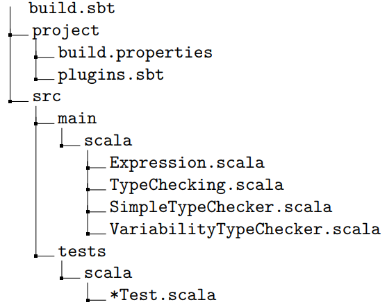

# Project Description

Your task is to implement type checkers for the simple programming language presented in the lecture and its typesystem, both for the version without variability and the version with variability. The implementation has to be done in [Scala](https://www.scala-lang.org/). The assignment is divided into the following two subtasks:

(a) Implement a type checker for the simple programming language *without variability* presented in the lecture and its type-system (slides 70/71) in the file `SimpleTypeChecker.scala`.

(b) Implement a type checker for the simple programming language *with variability* presented in the lecture and its type-system (slides 72-74) in the file `VariabilityTypeChecker.scala`. 

## Project Skeleton 
You must implement your solution based on the provided project skeleton. The skeleton has the following structure:


The file `Expression.scala` contains implementations of the programming language constructs and types. The file `TypeChecking.scala` contains the general interface for the type checkers. In addition, we provide an implementation of the type context for task (a). This class is also reused for task (b) for which we also provide an implementation of the variability context. The project skeleton also contains documentation for all provided classes and functions. 

We also provide some basic tests which can be found in the folder `tests`. The file `build.sbt` and the files in the folder `project` contain a build script that we use to [build your submission and run the tests](https://www.scala-sbt.org/1.x/docs/). You must not edit these files.

The build script should also enable you to import the project skeleton into any IDE with Scala support (e.g., IntelliJ with the Scala plugin). Scala can be quite sensitive regarding the used language version and things might break if you use the wrong one. For the assignment, we use Scala 3.2.1 which is also specified in the build script. You can also run the tests included with the project skeleton using the build script. To run all tests execute the command `sbt test`.

## Type Checker Result 
The type checker result is represented by the interface `TypeCheckResult` and its implementations `Success` and `Failure`. In the case of a successful type check an instance of `Success` has to be returned with the inferred type as its parameter. If the type checker detects a type error, it has to return an instance of `Failure` with the (sub-) expression that is currently checked, the context object, and an optional message describing the type error as parameters. This information is used by our tests to determine whether your implementation detected the error correctly. The message is not checked in the tests but can help you during debugging.

Note for advanced users: The result type supports monad operations meaning it can be used in [for-comprehensions](https://docs.scala-lang.org/tour/for-comprehensions.html).

## SAT Solver 
For some type rules of task (b), you will need a SAT solver to check certain preconditions. For this assignment, we use [CafeSAT](https://github.com/regb/cafesat) which is a simple SAT solver implemented in Scala.

The project skeleton already imports all the relevant packages. Checking whether a formula is satisfiable is as simple as this (assuming `a`, `b`, `c` are formulas):
```
Solver.solveForSatisfiability((!a || b) && c) match {
    case None => print("Not satisfiable");
    case Some(_) => print("Satisfiable")
}
```
Note how you can use `!`, `||`, and `&&` for *not*, *or*, and *and*. The API does not support implication so you have to
encode implication using the other operators. The primitives *true* and *false* are available as `Formulas.True` and `Formulas.False`. Mind the prepended `Formulas` as, otherwise, you might confuse them with the `True` and `False` literals from our programming languag