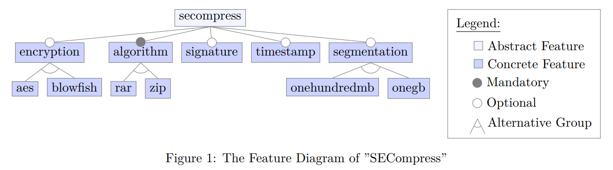

# Project Description

In this assignment, we analyze a non-functional property, performance, of a fictional tool "SECompress", a configurable command-line tool for compressing data. In addition, the data can be encrypted, signed, segmented, and/or timestamped. All this functionality is modeled by the feature diagram in Figure 1. For all the tasks in this Assignment we will use this tool with the features given in this diagram.


## CART Data Structure
For this assignment sheet we use the following internal datastructure for a CART. We represent a CART as a python dict with exactly the entries as shown in the example below. This example CART has three nodes. The root node ”X”, and the two child nodes ”XL” and ”XR”. As you can see the child nodes only have a name and a mean but all other fields are set to None. A parent node also has a name and a mean but additionally a feature by which the split is performed, the error of the split and two sucessors.
```
cart = { "name":"X", "mean":456, "split_by_feature": "aes", "error_of_split":73,
        "successor_left": { "name":"XL", "mean":1234, "split_by_feature": None,
            "error_of_split":None,
                "successor_left":None,
                "successor_right":None
        },
        "successor_right":{ "name":"XR", "mean":258, "split_by_feature": None,
            "error_of_split":None,
                "successor_left":None,
                "successor_right":None
        }
}
```
It is important to use exaclty these names for the features:
```
features = ["secompress", "encryption", "aes", "blowfish", "algorithm", "rar", "zip", "signature", "timestamp", "segmentation", "onehundredmb", "onegb"]
```

## Performance Data 
The performance data, given in a csv file, contains different configurations of SECompress with performance measurements.
```
Id,secompress,encryption,aes,blowfish,algorithm,rar,zip,signature,timestamp,segmentation,
onehundredmb,onegb,performance
0,1,0,0,0,1,1,0,0,0,0,0,0,750
1,1,0,0,0,1,1,0,0,0,1,1,0,773
2,1,0,0,0,1,1,0,0,0,1,0,1,770
3,1,0,0,0,1,1,0,0,1,0,0,0,750
4,1,0,0,0,1,1,0,0,1,1,1,0,773
```
## Task 1
(a) Implement an algorithm that creates a CART from performance data as presented in the lecture. The CART must be implemented by yourself, you must not take a prefabricated Python implementation. The format of the sample data and the representation of the CART are described below. If two split options are equally good, we use the alphabetic ordering of feature names as tie breaker.
```
def get_cart(sample_set_csv):
    # The sample_set_csv is a file path to a csv data, this can be imported into a dataframe
    df = pd.read_csv(sample_set_csv)
    # TODO: Write your code here. And change the return.
    return { "name":"X", "mean":1234, "split_by_feature": "rar", "error_of_split":42, "successor_left":None, "successor_right":None}
```
## Task 2
In the next task you will work on CARTs.
(a) Given a CART you should determine the name of the feature with the highest influence.
```
def get_highest_influence_feature(cart):
    # TODO: Write your code here. And change the return.
    return "secompress"
```
(b) Given a CART and a sample set, calculate the error rate. The error rate is computed by predicting the value with the given CART for every sample in the sample set and then averaging the differences between the predicted and original performance.
```
def get_error_rate(cart, sample_set_csv):
    # The sample_set_csv is a file path to a csv data, this can be imported into a dataframe
    df = pd.read_csv(sample_set_csv)
    # TODO: Write your code here. And change the return.
    return 42
```
(c) Given a CART and a partial configuration, compute a complete configuration which is in line with the partial configuration and has the least predicted costs.

The partial configuration and the configuration are python sets.
```
def get_optimal_configuration(cart, partial_configuration):
    # TODO: Write your code here. And change the return.
    return {"rar", "timestamp"}
```