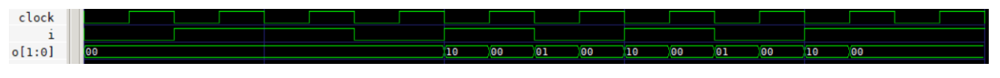
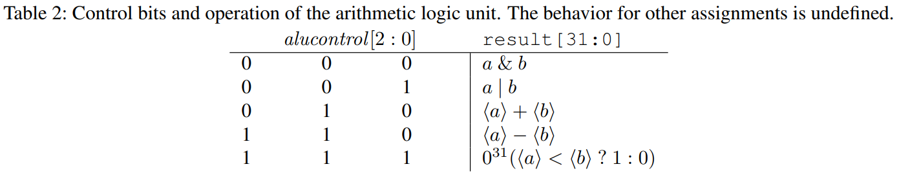

# Project Description
## Tools and Documentation
For the synthesis and simulation of Verilog code, we will use [Icarus Verilog](http://iverilog.icarus.com/), and for viewing generated waveforms, we will use [gtkwave](https://gtkwave.sourceforge.net/). Both programs are available for Linux, macOS, and Windows. Detailed installation.

To synthesize a top-level module M, whose definition including all sub-modules is contained in the files `file1.v` to `filen.v`, run the following command on the command line
```
iverilog -s M -o sim file1.v ... filen.v
```
To start the simulation run the generated binary `sim`. Depending on the testbench, you will see your results on the command line, or you will find a generated waveform file, which you can view with `gtkwave`.

A good and very detailed introduction to Verilog with many examples is provided by [Asic-World](http://www.asic-world.com/verilog/veritut.html). For information on using Icarus Verilog, see http://iverilog.wikia.com/wiki/Getting_Started and for GTKWave, see http://gtkwave.sourceforge.net/gtkwave.pdf.

For the main part of the project, you will need detailed information on the MIPS instruction set, in particular regarding the encoding of instructions. This information can be found on the official [MIPS](https://www.mips.com/?do-download=the-mips32-instruction-set-v6-06) website.

To run MIPS programs on your processor (e.g., for testbenches), you need the corresponding machine program. You can use the [MARS simulator](http://courses.missouristate.edu/kenvollmar/mars/) to write MIPS assembler programs and to translate them into machine code. To do this, use `File->Dump Memory` and select `Hexadecimal text`. To be compatible with Verilog's `readmemh`, please use our [customized version](https://cms.sic.saarland/sysarch21/materials/).

## Warm-Up Part
### Problem 1.1: Pattern Detection
You have already seen Mealy machines for detecting patterns on a previous assignment sheet. Here, we would like to detect the patterns 101 and 010 in a sequence of characters from the input alphabet {0, 1}. The output `o[1:0]` comes from the output alphabet {0, 1} × {0, 1}. The left bit `o[1]`/right bit `o[0]` of the output shall be 1 if and only if the two previous inputs together with the current input form the pattern 101/pattern 010. For example, if the machine has detected the pattern 101, the output shall be 10. In the beginning (i.e., before sufficiently many input characters have been read), the output shall be 00.

Implement such a Mealy machine as a Verilog module `MealyPattern`.

Write a testbench `MealyPatternTestbench` that validates the correctness of your construction for the sequence 0110101011. A waveform for this example sequence could look as follows:


###  Problem 1.2: Division Circuit
In the lectures, we have seen circuits for addition, subtraction and multiplication, but not for division. Integer division of two unsigned binary numbers can be implemented as a *sequential circuit*, based on the grade school division method. The division ⟨A⟩/⟨B⟩ according to the school method can be expressed algorithmically as follows.
```
R = 0
for i = N-1 to 0
    R' = 2 * R + A[i]
    if (R' < B) then Q[i] = 0, R = R'
        else Q[i] = 1, R = R'-B
```
**Exercise** Compute 7/3 using this algorithm.

Now design the corresponding sequential circuit. The division circuit has two 32-bit inputs *A* and *B*, a 1-bit input *start*, an input *clock* and two 32-bit outputs *Q* and *R*, where *Q* is the quotient, and *R* is the remainder. 32 cycles after *start* = 1 at a rising clock edge, let ⟨Q⟩ be the quotient and ⟨R⟩ the remainder of the division ⟨A⟩/⟨B⟩. If *start* = 1 occurs again during the computation of a division, the circuit aborts the current computation and starts over with the new operand values. In the following section, we provide some additional guidance.

Implement your sequential circuit as a Verilog module `division` and verify your design using testbenches.

**Notes** The sequential circuit shall perform one iteration of the loop per cycle between two consecutive rising clock edges, i.e. essentially one subtraction and one negativity test. Multiplication in hardware is expensive. Therefore, try to express the multiplication by cheaper shift operations.

Use three 32-bit wide registers to store the current state of the sequential circuit: The first register stores the current value of the remainder *R*. The second register stores the current value of the divisor *B*. The third register stores the remaining of the dividend *A* and the already computed bits of the quotient *Q*. Thus, before iteration i,
the third register has the state

{*A*[*i* : 0], *Q*[*N* - 1 : *i* + 1]}

If at a rising edge of *clock* the start signal is set (*start* = 1), we store the inputs *A* and *B* in the corresponding registers and start the computation. A computation takes exactly 32 cycles; after that, the correct result is available at the outputs until a new division starts. To achieve that not in every cycle an iteration is executed, but only in the first 32 cycles after the *start*, it can be helpful to use a counter.

## Main Part
### Problem: Single-Cycle MIPS Implementation
Familiarize yourself with the (almost complete) Verilog implementation of the single-cycle machine from the lecture. The machine so far supports the `addu`, `subu`, `and`, `or`, `sltu`, `lw`, `sw`, `addiu`, `beq`, and `j` instructions.

### Problem 2.1: Arithmetic Logic Unit
Implement the module `ArithmeticLogicModul` in the datapath and complete the corresponding control bits in the decoding unit according to Table 2.  The 1-bit output `zero` is 1 if and only if the result of the ALU `result[31:0]` is zero (0<sup>32</sup>).

### Problem 2.2: Loading Constants
To load 32-bit constants, the two instructions `lui` and `ori` are very useful. Look up their encoding and operation in the MIPS instruction set documentation. Extend the datapath and the decoder to implement these instructions. Try to change the existing interface between the datapath and the decoder as minimally as possible.

Hint: It may be useful to already have the following exercises in mind when you modify the interface between the decoder and the datapath.

### Problem 2.3: Branches
Implement the branch instruction `bne`. Try not to change the existing interface between the datapath and the decoder.

### Problem 2.4: Multiplication
Implement the unsigned multiplication of the MIPS instruction set, more precisely the `multu` instruction. Think about in which module of the datapath the destination registers `HI` and `LO` should be placed, and what the logical state of a MIPS machine with multiplication is.

To process the result of a multiplication, the instructions `mflo` and `mfhi` are needed. Implement these two instructions. Try to change the existing interface between the datapath and the decoder as minimally as possible.

### Problem 2.5: Function Calls
To support function calls efficiently, one needs a so-called *link register* to store the return address, which is needed to return to the caller at the end of a function call. The convention on MIPS machines is to use register 31. In assembler code, it is therefore also referred to as *ra* (*return address*).

Implement the `jal` and `jr` instructions for function calls and returns. Try to change the existing interface between the datapath and the decoder as minimally as possible.

Note: MIPS uses so-called *branch delay slots*. This means that the instruction located immediately after a branch or jump instruction is executed before the jump actually occurs. Therefore, the MIPS documentation lists `PC + 8` as the value of the link register. However, we do not consider delay slots for this project, and thus, the `jal` instruction shall write `PC + 4` to the link register.

### Problem 2.6: Bonus: Division 1
Implement the `divu` MIPS instruction using your division circuit from the warm-up part. Therefore, the division needs 32 cycles. During this time, the values of the `LO` and `HI` registers are considered to be unpredictable.

Use the `divu` instruction from page 171 of the MIPS documentation, which describes an older variant of the instruction that stores the result in `HI` and `LO`. More recent MIPS variants write the quotient directly to a generalpurpose register.

Note: Use the registers `LO` and `HI` in a clever way, i.e., think about what they may store in the sequential
circuit. *clever*[0.5cm] There is a dependency between the *read* operation of a `mflo/hi` instruction and the *write* operation of a preceding `divu` instruction. The division instruction needs several clocks to compute the correct result. In the meantime, the single-cycle machine is already processing the subsequent instructions. This makes the above read-write dependency problematic: it now depends on the number of instructions between `mflo/hi` and `divu` whether `mflo/hi` reads the correct result or an unpredictable value. Such a situation is therefore called a *hazard*. To avoid the above *hazard*, one should not execute `mflo` or `mfhi` for 32 cycles after a division. The programmer or the compiler must ensure that this convention, also called *Software Condition*, is observed.

### Problem 2.7: Bonus: Division 2
We would like to get rid of the *Software Condition* described above to make the programmer’s life easier. Instead of resolving the *hazard* in software, one can also resolve such situations in hardware. For this, one uses a so-called *interlock*: if one detects that the current instruction accesses the `HI` or the `LO` register while a division is being executed, one "delays" the execution of the instruction.

Think about how such a "delay" can be implemented. Extend your division circuit to include an output `busy` that is 1 while a division is being executed. Implement an interlock mechanism for the situation described above.